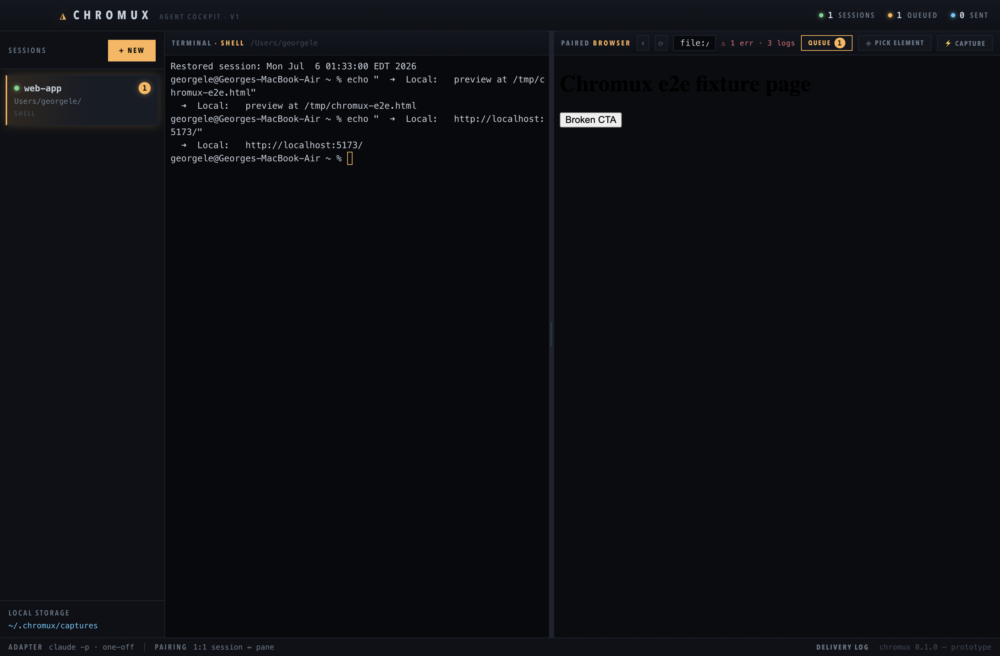

# Chromux — v1 prototype

A macOS desktop **agent cockpit**: parallel Claude Code / Codex / Grok Build terminal sessions,
each paired 1:1 with an embedded Chromium browser pane. Localhost dev-server previews and
generated `file://` HTML open next to the session that produced them — no alt-tabbing — and
one click packages browser evidence (console tail + picked element + screenshot + URL) into a
YAML payload delivered to an agent via `claude -p`.

Scope follows `research/idea-brief.md`: this is the "smallest v1 you'd actually use every day"
(interview round 2, Q5). Deferred: live-session stdin injection, full network telemetry,
unified-sidebar layout toggle, productization.



## Quickstart — the first local loop

Requires: macOS, Node 22.12+, Xcode command-line tools (for the `node-pty` native build), and the
`claude` CLI on your PATH (only needed for delivery; everything else works without it).

```sh
cd prototype
npm install        # also rebuilds node-pty against Electron
npm start
```

### Install as a macOS app

```sh
npm run install-app   # packages Chromux.app (arm64) and copies it to /Applications
```

This builds `dist/Chromux-darwin-arm64/Chromux.app` with `@electron/packager` (asar-packed,
with `node-pty` unpacked so its `spawn-helper` can exec) and replaces any existing
`/Applications/Chromux.app`. The app is unsigned — fine for a locally-built personal tool;
Gatekeeper only quarantines downloaded bundles. Launch from Spotlight as "Chromux". Both the
terminal PTY and `claude -p` delivery run through your login shell, so PATH and CLI auth work
the same as in Terminal even when launched from Finder.

Then complete the loop:

### Appearance themes

Open **SETTINGS** and choose **Blueprint**, **Retro-OS**, **Streak**, or **Liquid Glass**. The
selected theme and its independent **Light** or **Dark** mode apply immediately to the full cockpit
and terminal palette, then persist locally for the next launch. New profiles start with Liquid Glass
Light. Run `npm run capture:themes -- /tmp/chromux-theme-shots` to generate deterministic
screenshots of the open theme picker in all eight theme/mode combinations.

### Developer diagnostics

Interactive source launches show a read-only diagnostics strip above the shortcut status bar. It can
inspect any open or exited session independently of tab focus and compares the unified Threads attention projection,
tracked turn state, rendered tab indicator, update safety, browser queue, and recent sanitized events.
Packaged launches hide the strip by default. Use **SETTINGS → DEVELOPER MODE** to change the persisted
setting; Chromux confirms when sessions are open, saves a restore snapshot, and restarts to apply it.
The `--dev-mode` and `--no-dev-mode` flags take precedence over the saved preference.

### Session rail

The left rail has two persisted icon views while the horizontal tabs remain the primary navigator.
**Threads** is the default unified session view. A pinned, expanded **Needs Attention** section appears
above exact-working-directory groups whenever sessions have actionable items, failed deliveries, queued
browser previews, or unseen background completions. Each session appears once, with all of its reasons and
actions together, and returns to its directory group as soon as the last reason clears. Managed
**Chromux Update** status appears in a pinned system row above Needs Attention. Opening or dismissing a
completion consumes it to a quiet Idle state, while completions already visible in the active session become
Idle immediately. Click an inactive Threads row to inspect a live, read-only terminal preview without
changing sessions; click anywhere in the preview (or press Enter/Space) to open that session, and press
Escape or click outside to close it. Clicking the already-active Threads row confirms the connection with
a linked row-to-terminal highlight. Choose **Settings → Thread Preview Size → Compact, Comfortable, or
Large** to adjust effective preview text size without changing terminal wrapping; Comfortable is the default.
**Git Changes** tracks the working-copy diffs in repositories used by live sessions,
showing each changed file, its status, whether it has staged changes, and repository-level staged/unstaged
totals. It refreshes automatically while selected. The badge on Threads counts individual outstanding items,
including managed-update notices, without switching away from Git Changes.

### Multiline terminal composer

Native xterm input remains the default. Open the per-session composer with the terminal-header
**COMPOSE** button or `Command+Shift+Enter`. Inside it, `Enter` inserts a newline,
`Command+Shift+Enter` submits, and `Escape` closes without clearing. A successful submission clears
the editor but leaves it open and focused. Shell-only sessions show a confirmation before multiline
text is sent; canceling keeps the draft untouched. Closing the composer returns focus to raw xterm,
which remains the escape hatch for interactive terminal input.

Drafts are capped at 64 KiB and persist independently in managed restore snapshots. **HISTORY** and
`Option+Up` / `Option+Down` reuse prompts from sessions with the same canonical working directory.
History is local plaintext, searchable, individually deletable, clearable per project with confirmation,
deduplicated by exact prompt text, limited to 100 entries per project, and capped at 5 MiB globally.

### Host resources and parallel agents

Open **RESOURCES** to inspect host-wide owners, FIFO queues, lease expiry, wait time, and iOS Simulator capacity. Chromux uses a background Unix-socket broker shared by the app and Codex MCP clients. See [`docs/resource-broker.md`](docs/resource-broker.md) for MCP registration, the optional LaunchAgent, global Computer Use guidance, and simulator wrapper contract. Prefer Codex's built-in Browser for web-app testing; native macOS and foreground Simulator work must lease `macos:foreground-input`.

1. **Start a session** — `+ NEW`, pick your project directory, choose CLAUDE CODE / CODEX /
   GROK BUILD / SHELL ONLY. Chromux spawns your login shell and launches the agent CLI
   *unchanged* — it wraps the CLIs, never modifies them.

   **…or adopt what's already running** — hit **⛶ DETECT** (⌘D). Chromux scans your open
   terminal tabs (`ps` + `lsof`, tab titles via Terminal.app/iTerm2 AppleScript) and lists
   every live `claude` / `codex` / `grok` process with its project directory, plus plain-shell
   tabs. Per row: **RESUME** re-opens that project's latest saved conversation in a new
   Chromux session (`claude --resume <id>` / `codex resume <id>` / `grok --resume <id>`),
   **FRESH** starts a new one in the same directory, **OPEN SHELL** adopts a shell tab's cwd.
   **OPEN ALL AGENTS** does the lot, resuming where a saved session exists. The original tabs
   are never touched — everything is read-only; if the agent is still running in the terminal,
   the resumed copy diverges from the last save point.
2. **Approve the preview** — run your dev server (or ask the agent to). When the terminal
   prints `http://localhost:5173` (or any loopback URL, or an absolute `/path/to/page.html`),
   Chromux queues it in the badged **QUEUE** — nothing auto-opens. Approve with queue
   **OPEN**, click a terminal link, or type a URL in the browser bar and hit ⏎.
   Opening a URL also restores a shut browser. New sessions start with the paired browser
   shut; use **BROWSER** / **COLLAPSE** or `Command+Shift+B` to open/shut it. Re-emitting
   the same already-open URL auto-refreshes the pane (throttled). Popups queue too.
### Saved projects

In **NEW SESSION**, choose a directory with a readable `package.json`, select a script, and save the
validated configuration. **START PROJECT** opens a shell-only Chromux session in that directory and runs
the derived package-manager command. A detected dev-server URL enters that session's review queue and is
never opened until you approve **OPEN**. v1 uses `package.json` scripts only; `devctl` / `apps.json` sources
are deferred until their schema is defined.

3. **Capture evidence** — hit **⌖ PICK ELEMENT**, hover to highlight, click the broken thing
   (Esc cancels). Or **⚡ CAPTURE** for a page-level capture. Review the YAML payload, add a
   note, pick a target (paired session by default, redirectable), then:
   - **SEND — claude -p**: runs a one-off `claude -p` in the target session's project
     directory with the payload as the prompt, streaming output back; or
   - **FILE-DROP ONLY**: just writes the payload to disk for manual use.

Every capture is written to `~/.chromux/captures/<timestamp>/payload.yaml` (+
`screenshot.png`) *before* delivery, so a failed send is always manually retryable — the
failure screen shows the exact retry command. Every attempt is logged to
`~/.chromux/delivery-log.jsonl` (DELIVERY LOG button in the status bar).

## What's in the box

| Piece | File | Notes |
| --- | --- | --- |
| Main process | `main.js` | PTYs (`node-pty`), capture persistence, `claude -p` adapter, popup interception, external terminal/agent-session detection (Claude / Codex / Grok) |
| Bridge | `preload.js` | narrow `window.chromux` API, no node in the page |
| Guest bridge | `webview-preload.js` | element-picker results and focused-editable status |
| UI | `renderer/` | sessions, xterm terminals, paired webviews, review queue, capture modal |
| Payload contract | `docs/capture-payload.md` | schema v1, field bounds, retention |
| Privacy and local data | `docs/privacy-and-local-data.md` | local storage map, outbound boundaries, deletion guidance |

## Troubleshooting

See [`docs/troubleshooting.md`](docs/troubleshooting.md) for the full support guide.

- **`node-pty` failed to build** — install Xcode CLT (`xcode-select --install`), then
  `npm run rebuild`.
- **Preview not detected** — detection scans complete terminal lines for
  `http(s)://localhost|127.0.0.1|0.0.0.0|[::1]` URLs (a port or path is required, so wrapped
  fragments don't false-positive) and absolute `*.html` paths (which must exist on disk).
  Paste the URL into the pane's URL bar as a manual fallback.
- **`claude -p` exits non-zero** — delivery runs `claude -p` through your login shell, so PATH
  and auth match your terminal. Check `claude` works there; the payload file is kept and the
  modal shows a copy-pastable retry command.
- **Screenshot missing** — capture keeps the payload without it and marks
  `screenshot.mode: unavailable`.
- **DETECT shows tabs without titles** — grant Chromux Automation access to Terminal/iTerm2
  (System Settings → Privacy & Security → Automation; macOS prompts on the first scan).
  Detection itself (`ps`/`lsof`) works without it — you just lose the tab titles.
- **DETECT's RESUME opens the wrong conversation** — resume targets the *latest saved*
  session for the tab's project directory (`~/.claude/projects/<dir>` /
  `~/.codex/sessions` / `~/.grok/sessions/<encoded-cwd>`); two agents in the same directory
  can't be told apart.

## Storage map

| What | Where |
| --- | --- |
| Capture payloads + screenshots | `~/.chromux/captures/<timestamp>/` |
| Delivery log | `~/.chromux/delivery-log.jsonl` |
| Restore snapshot | `~/.chromux/restore-sessions.json` (schema v5; includes validated provider conversation IDs, optional 64 KiB composer drafts, and up to 20 bounded historical Needs Attention records per session) |
| Prompt history | `~/.chromux/prompt-history.json` (local plaintext, mode `0600`, 100 entries/project, 5 MiB total) |
| Saved projects | `~/.chromux/projects.json` |
| Update cache/source/install log | `~/.chromux/update-cache.json`, `~/.chromux/update-source.json`, `~/.chromux/update-install.log` |
| Hook settings and notify scripts | `~/.chromux/hooks-claude.json`, `~/.chromux/codex-notify.sh`, `~/.chromux/hooks-grok.json`, `~/.chromux/grok-hook.sh`, and `~/.grok/hooks/chromux-turn-signals.json` |
| Resource broker | `~/.chromux/resource-broker.sock`, `~/.chromux/resource-broker.lock`, `~/.chromux/resource-broker-state.json`, and optional `~/.chromux/resource-broker.log` |

## Agent attention protocol

Chromux creates a random 256-bit signal token for every PTY and exposes it only
to that session's processes. Generated hooks use Electron's embedded Node
runtime to classify native callback JSON, bound message text, and write an
authenticated base64url-JSON v2 OSC envelope to `/dev/tty`. Chromux rejects
wrong session, token, or agent claims; malformed or oversized envelopes;
duplicates; stale sequences and turns; and invalid transitions. Legacy v1 OSC
remains accepted at lower confidence, and Codex prompt output is only a final
fallback after a recently inferred working turn.

Claude Code and Grok Build provide native start, actionable-notification, and
completion callbacks. Codex provides native completion while start is inferred
from submitted Enter; its actionable notification capabilities are unavailable.
Unknown native notifications are retained in local diagnostics and never create
an attentive Threads reason. A background completion remains in Needs Attention until its session is opened
or that reason is explicitly dismissed; a completion received by the active session is already seen. Opening a session never
dismisses permission, authentication, input, rate-limit, or tool-failure attention. Chromux does not post
macOS Notification Center alerts.
| Browser pane profiles | Session-specific Electron partitions `persist:chromux-<session ID>` |

Chromux has no account, cloud sync, Chromux-hosted capture upload, or product
telemetry in the current prototype. Browser pages, update checks, agent CLIs,
and `SEND - claude -p` can make outbound requests. See
[`docs/privacy-and-local-data.md`](docs/privacy-and-local-data.md) for the full
data-handling notice.

### Global favorites

Use the star beside the paired browser URL to favorite the current document or
URL, or use `PIN` on a queued preview. `FAVORITES` shows the same global list in
every session; selecting an entry opens it in the active session's paired
browser and restores that browser if it is shut.

Favorites are stored locally in `~/.chromux/favorites.json`. Chromux keeps at
most 200 validated `http:`, `https:`, or `file:` entries, removes URL fragments
for deduplication, and never syncs the list. Delete that file while Chromux is
closed to clear all favorites.
