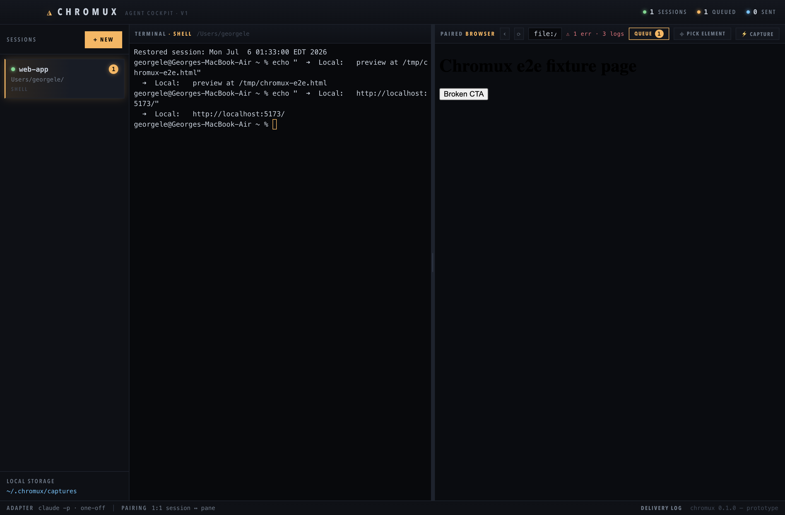

# Chromux — v1 prototype

A macOS and Windows desktop **agent cockpit**: parallel Claude Code / Codex / Grok Build terminal sessions,
each paired 1:1 with an embedded Chromium browser pane. Localhost dev-server previews and
generated `file://` HTML open next to the session that produced them — no alt-tabbing — and
one click packages browser evidence (console tail + picked element + screenshot + URL) into a
YAML payload delivered to an agent via `claude -p`.

Scope follows `research/idea-brief.md`: this is the "smallest v1 you'd actually use every day"
(interview round 2, Q5). Deferred: live-session stdin injection, full network telemetry,
unified-sidebar layout toggle, productization.



## Quickstart — the first local loop

Requires: macOS, Node 22.12+, Xcode command-line tools (for the `node-pty` native build), and the
`claude` CLI on your PATH (only needed for delivery; everything else works without it).

On Windows, Chromux requires Windows 10 22H2+ x64 (build 19045 or newer,
including Windows 11), an updated WSL2 installation, and an initialized WSL2
distribution containing Bash, Git, Node 22.12+, and each desired agent CLI.
Run `wsl --update` before setup. Older Windows builds, WSL1, ARM64, native
PowerShell, and Git Bash sessions are not supported. Choose the default
distribution in Settings. Changing it affects new records only; existing
sessions/projects retain their distribution. Each runtime has its own
**Projects Root**; Windows keeps a separate canonical Linux path for every WSL
distribution.

```sh
cd prototype
npm install        # also rebuilds node-pty against Electron
npm start
```

### Install as a macOS app

```sh
npm run install-app   # packages Chromux.app (arm64) and copies it to /Applications
```

This builds `dist/Chromux-darwin-arm64/Chromux.app` with `@electron/packager` (asar-packed,
with `node-pty` unpacked so its `spawn-helper` can exec) and replaces any existing
`/Applications/Chromux.app`. The app is unsigned — fine for a locally-built personal tool;
Gatekeeper only quarantines downloaded bundles. Launch from Spotlight as "Chromux". Both the
terminal PTY and `claude -p` delivery run through your login shell, so PATH and CLI auth work
the same as in Terminal even when launched from Finder.

### Build the Windows installer

On Windows:

```powershell
npm ci
npm run make:win
```

Forge produces `GBlockParty-Chromux-Setup-0.69.2-x64.exe`,
`GBlockPartyChromux-0.69.2-full.nupkg`, and `RELEASES` under
`out/make/squirrel.windows/x64`. This first per-user installer is unsigned, so
SmartScreen normally displays **Windows protected your PC**. Select **More info
→ Run anyway** only for an installer verified against the official GitHub
Release. Enterprise policy can prohibit unsigned apps.

Then complete the loop:

### Appearance themes

Open **SETTINGS** and choose **Blueprint**, **Retro-OS**, **Streak**, or **Liquid Glass**. The
selected theme and its independent **Light** or **Dark** mode apply immediately to the full cockpit
and terminal palette, then persist locally for the next launch. New profiles start with Liquid Glass
Light. Run `npm run capture:themes -- /tmp/chromux-theme-shots` to generate deterministic
screenshots of the open theme picker in all eight theme/mode combinations.

### Session tab groups

The tab bar remains flat by default. Enable **SETTINGS → SESSION TAB GROUPS** to show custom and
directory groups in an upper strip and the focused group’s sessions in a lower strip. Automatic
groups use the session’s exact normalized working directory; custom membership overrides that
directory until **Move to group… → Automatic directory** is chosen from the session context menu.
Custom groups can be created, renamed, or deleted in Settings. Empty custom groups remain available
there but stay out of the upper strip. Group selection remembers its last-active session, and search
or numeric session shortcuts reveal both destination tabs. The preference and custom definitions
stay in the local Chromium profile; membership and focus are included in normal app-close/update
restore snapshots.

### Developer diagnostics

Interactive source launches show a read-only diagnostics strip above the shortcut status bar. It can
inspect any open or exited session independently of tab focus and compares the unified Threads attention projection,
tracked turn state, rendered tab indicator, update safety, browser queue, and recent sanitized events.
Packaged launches hide the strip by default. Use **SETTINGS → DEVELOPER MODE** to change the persisted
setting; Chromux confirms when sessions are open, saves a restore snapshot, and restarts to apply it.
The `--dev-mode` and `--no-dev-mode` flags take precedence over the saved preference.

For live Codex lifecycle investigation, run `npm run activity-lab`. This opens
a separate Activity Indicator Lab entry point with a temporary Electron profile;
it never restores, changes, or launches normal Chromux sessions. Each scenario
requires an explicit **Run**, states its model-turn usage, and compares an
interactive Codex PTY with a structured `codex exec --json` reference in fresh
temporary workspaces. Both lanes use a read-only sandbox, disabled approvals,
bounded output and runtime, cancellation, and cleanup. Exported JSON contains
signal ordering, timings, versions, and mismatch summaries but no response text.
The real-Codex UAT is deliberately manual and opt-in:
`CHROMUX_ACTIVITY_LAB_UAT=1 node scripts/run-activity-lab-uat.js`.

To probe whether one visible TUI turn can be observed through Codex 0.145.x's
experimental app-server without launching `codex exec`, use the separately
budgeted same-turn harness:

```bash
npm run probe:codex-same-turn -- --scenario idle --allow-model-turns 0
npm run probe:codex-same-turn -- --scenario gate1 --allow-model-turns 2
```

The live command refuses to run without an explicit allowance. It creates
ephemeral read-only threads and temporary workspaces/sockets, records no prompt,
response, terminal output, or structured item content, and does not retry after
`turn/started`. Codex 0.145.0 did not expose the visible TUI lifecycle to the
observer in the v0.69.0 approval run, so normal Chromux sessions do not start a
persistent app-server sidecar. Pending Codex submissions are shown without
animation; only confirmed Working animates.

### Session rail

The left rail has two persisted icon views while the horizontal tabs remain the primary navigator.
**Threads** is the default unified session view. A pinned, expanded **Needs Attention** section appears
above exact-working-directory groups whenever sessions have actionable items, failed deliveries, queued
browser previews, or unseen background completions. Each session appears once, with all of its reasons and
actions together, and returns to its directory group as soon as the last reason clears. Managed
**Chromux Update** status appears in a pinned system row above Needs Attention. Opening or dismissing a
completion consumes it to a quiet Idle state, while completions already visible in the active session become
Idle immediately. The thread-list filter defaults to **Recent**, ordering Working sessions and working-directory
groups by meaningful work (creation, submitted prompts, turn-state changes, or explicit attention actions)
without moving rows or groups during session navigation; toggling it to **A–Z**
alphabetizes group and session display labels instead. The icon-only control sits below the Threads header,
left-aligned within the toolbar's existing 8 px inset; its validated choice stays in renderer local storage,
does not affect Needs Attention urgency, and is hidden in Git Changes. Streaming terminal output does not
reorder rows. Click an
inactive Threads row to activate that session, reveal its tab, and return focus to its terminal or open
composer. Hover over an inactive row for a brief pause, or move keyboard focus to it, to inspect a live,
read-only terminal preview without changing sessions. The preview stays open while the pointer is over
either surface; keyboard focus remains on the row, where Enter/Space activates and Escape closes the preview.
Clicking anywhere in the preview is a secondary activation path, while clicking outside closes it. Clicking
the already-active Threads row confirms the connection with a linked row-to-terminal highlight. Choose
**Settings → Thread Preview Size → Compact, Comfortable, or Large** to adjust effective preview text size
without changing terminal wrapping; Comfortable is the default.
**Git Changes** tracks the working-copy diffs in repositories used by live sessions,
showing each changed file, its status, whether it has staged changes, and repository-level staged/unstaged
totals. It refreshes automatically while selected. The badge on Threads counts individual outstanding items,
including managed-update notices, without switching away from Git Changes.

### Multiline terminal composer

Native xterm input remains the default. Open the per-session composer with the terminal-header
**COMPOSE** button or `Command+Shift+Enter`. Inside it, `Enter` inserts a newline,
`Command+Shift+Enter` submits, and `Escape` closes without clearing. A successful submission clears
the editor but leaves it open and focused. Shell-only sessions show a confirmation before multiline
text is sent; canceling keeps the draft untouched. Closing the composer returns focus to raw xterm,
which remains the escape hatch for interactive terminal input.

Drafts are capped at 64 KiB and persist independently in managed restore snapshots. **HISTORY** and
`Option+Up` / `Option+Down` reuse prompts from sessions with the same canonical working directory.
History is local plaintext, searchable, individually deletable, clearable per project with confirmation,
deduplicated by exact prompt text, limited to 100 entries per project, and capped at 5 MiB globally.

In full-Chromux browser mode, use the browser rail’s **COMPOSE** control or
`Command+Shift+Enter` (`Control+Shift+Enter` on Windows) to dock the existing Composer beneath the
full-width mounted browser. `Escape` closes the drawer without clearing its draft. Choose any live
session as the target; the paired session is selected fresh each time the drawer opens. Sends use the
recipient’s normal terminal-input path and prompt history while the source browser stays visible.
Working agents accept steering. A target that exited, has pending terminal input, or owns a Composer
draft is blocked with a direct switch-to-target action.

Page evidence is opt-in. **ATTACH CURRENT PAGE** persists the current URL, title, bounded visible text,
console tail, and screenshot before showing a removable/refreshable chip. Only attached evidence adds
bounded payload, screenshot, URL, and title references to the sent prompt. Successful existing-session
sends clear attachments; failures preserve them.

### Durable localhost first-success proof

The dependency-free fixture under `examples/localhost-first-success/` is the
stable local review target used by Chromux's first-success proof:

```sh
npm run fixture:localhost-first-success
npm run test:localhost-first-success
```

It binds only to `127.0.0.1`, defaults to `http://localhost:43117/`, serves
`/` and `/healthz` without external resources, and prints one canonical
`Local:` line for preview detection. The deterministic test uses an ephemeral
port and no model. The visible live proof is intentionally separate and
refuses to run unless exactly one model turn is authorized:

```sh
npm run uat:localhost-first-success -- --allow-model-turns 1
```

That UAT submits once with no retry, retains only a bounded sanitized response
excerpt and artifact metadata, and removes its temporary Chromux profile and
captures after recording the report.

### Capture delivery recovery proof

Run the deterministic recovery UAT with:

```sh
npm run uat:capture-delivery-recovery
```

It uses an isolated Chromux home and controlled local `claude` fixture: the
first real Electron delivery exits nonzero, the payload, screenshot, and
delivery-log entry are verified, and the documented manual retry command
delivers the persisted YAML content on the second invocation. It never calls a
real account, network service, or model. The sanitized transcript is archived
at [`docs/testing/capture-delivery-recovery-uat-0.69.4.md`](../docs/testing/capture-delivery-recovery-uat-0.69.4.md).

Select **New session** to choose Claude, Codex, Grok, or Shell; Grok still requires its data-risk
acknowledgment. Chromux creates one canonical session in the same runtime, distribution, directory,
and current URL with a fresh browser partition, activates it in full-browser mode, moves staged
attachments, and leaves the composed prompt unsent for review.

### Host resources and parallel agents

Open **RESOURCES** to inspect host-wide owners, FIFO queues, lease expiry, wait time, and iOS Simulator capacity. Chromux uses a background Unix-socket broker shared by the app and Codex MCP clients. See [`docs/resource-broker.md`](docs/resource-broker.md) for MCP registration, the optional LaunchAgent, global Computer Use guidance, and simulator wrapper contract. Prefer Codex's built-in Browser for web-app testing; native macOS and foreground Simulator work must lease `macos:foreground-input`.

The same MCP server can list opaque local capture targets, request an approved
paired-browser or whole-Chromux screenshot, and record the Chromux window for up
to 60 seconds on macOS. Every capture requires **ALLOW ONCE** in the app; target
listing never exposes page URLs. Recordings prefer system audio and visibly
continue video-only when loopback audio is unavailable. Results include direct
images and private local `chromux://capture/...` resources. See
[`docs/resource-broker.md`](docs/resource-broker.md#capture-control-and-artifact-resources).

1. **Start a session** — `+ NEW` or `Command+T` (`Control+T` on Windows) opens
   **Open Existing**. Pick your project directory, choose CLAUDE CODE / CODEX /
   GROK BUILD / SHELL ONLY. Chromux spawns your login shell and launches the agent CLI
   *unchanged* — it wraps the CLIs, never modifies them.

   **Create a project** — `Command+N` (`Control+N` on Windows) opens the
   launcher's **Create Project** tab. Choose a fresh Git repository or a clone
   URL, kebab-case name, configured category, optional sandbox type, and agent.
   Chromux previews the canonical destination and offers **CREATE ONLY** or the
   primary **CREATE & LAUNCH** action. Creation is native and does not require
   the `p` shell function.

   **…or adopt what's already running** — hit **⛶ DETECT** (⌘D). Chromux scans your open
   terminal tabs (`ps` + `lsof`, tab titles via Terminal.app/iTerm2 AppleScript) and lists
   every live `claude` / `codex` / `grok` process with its project directory, plus plain-shell
   tabs. Per row: **RESUME** re-opens that project's latest saved conversation in a new
   Chromux session (`claude --resume <id>` / `codex resume <id>` / `grok --resume <id>`),
   **FRESH** starts a new one in the same directory, **OPEN SHELL** adopts a shell tab's cwd.
   **OPEN ALL AGENTS** does the lot, resuming where a saved session exists. The original tabs
   are never touched — everything is read-only; if the agent is still running in the terminal,
   the resumed copy diverges from the last save point. For Codex, DETECT still infers one target:
   the newest interactive CLI thread whose recorded cwd exactly matches the detected process.
   When supported by the installed Codex, the row uses that thread's explicit name (or first
   user-message preview) and a bounded excerpt of its latest agent message. Chromux reads those
   values locally through `codex app-server`; the excerpt exists only for the active DETECT scan
   and is not added to workspace restore snapshots. Older Codex versions fall back to the local
   rollout-file index and the existing terminal/directory label.
2. **Approve the preview** — run your dev server (or ask the agent to). When the terminal
   prints `http://localhost:5173` (or any loopback URL, or an absolute `/path/to/page.html`),
   Chromux queues it in the badged **QUEUE** — nothing auto-opens. Approve with queue
   **OPEN**, click a terminal link, or type a URL in the browser bar and hit ⏎.
   Loopback rows show **CHECKING…**, **READY**, or **SERVER OFFLINE** from a bounded TCP probe.
   Offline rows offer **RECHECK** and **START SERVER…**. The launcher reads only the originating
   directory's validated `package.json` scripts, starts the selected script in a visible
   non-focused shell tab, and never substitutes for the separate **OPEN** approval.
   Opening a URL also restores a shut browser. New sessions start with the paired browser
   shut; use **BROWSER** / **COLLAPSE** or `Command+Shift+B` to open/shut it. Re-emitting
   the same already-open URL auto-refreshes the pane (throttled). Use the browser rail’s
   expansion control or `Command+Shift+F` (`Control+Shift+F` on Windows) to apply
   **Settings → Browser Fullscreen Behavior** to the active session: full Chromux, paired
   workspace, or the paired → terminal → full-Chromux cycle. This preserves native macOS
   `Control+Command+F` fullscreen. Popups queue too.
   In full-Chromux mode, the rail also exposes **COMPOSE** for the routed browser/Composer
   presentation; the mounted page, tabs, URL, queue, console tail, draft, and history remain intact.

   Each terminal session owns its own horizontally scrollable browser tab strip. Terminal
   links, queue entries, favorites, and project HTML selections open a new tab or focus an
   already-open normalized URL. Typing a web URL navigates the active page tab. Use **⌕**
   (or type `file:`, `/`, `./`, `../`, `~/`, or an HTML filename) to open the project HTML
   explorer without suspending live page tabs.
### Saved projects

In **NEW SESSION**, choose a directory with a readable `package.json`, select a script, and save the
validated configuration. **START PROJECT** opens a shell-only Chromux session in that directory and runs
the derived package-manager command. A detected dev-server URL enters that session's review queue and is
never opened until you approve **OPEN**. v1 uses `package.json` scripts only; `devctl` / `apps.json` sources
are deferred until their schema is defined. The offline-preview launcher uses the same validation and
runner selection, recommends `dev`, `start`, `serve`, then `preview`, and never stores arbitrary command text.
Its shell tab remains available for logs and follows the normal Chromux PTY lifecycle.

### Native `np`-compatible project creation

Chromux reads categories from `~/.config/p/categories.conf` inside the active
runtime and uses `p`'s defaults when that file is absent. The initial Projects
Root comes from `P_BASE` when available, otherwise `<runtime-home>/projects`;
later changes are stored per host or WSL distribution in Chromux preferences.
Flat, lifecycle, and sandbox categories resolve to `<category>/<name>`,
`<category>/dev/<name>`, and `sandbox/<sandbox-type>/<name>`.

Fresh projects run `git init`; clones run `git clone` with argument-safe process
execution. Chromux builds in a unique sibling staging directory and moves the
completed repository into place. It then updates `p`'s deduplicated 50-entry
history, removes the `p_completion` and `sp_completion` caches, and invokes an
executable `P_NP_HOOK` with name, category, category type, and final path.
History, cache, or hook failures are shown as warnings without deleting a
successfully created project.

3. **Capture evidence** — hit **⌖ PICK ELEMENT**, hover to highlight, click the broken thing
   (Esc cancels). Or **⚡ CAPTURE** for a page-level capture. Review the YAML payload, add a
   note, pick a target (paired session by default, redirectable), then:
   - **SEND — claude -p**: runs a one-off `claude -p` in the target session's project
     directory with the payload as the prompt, streaming output back; or
   - **FILE-DROP ONLY**: just writes the payload to disk for manual use.

Every capture is written to `~/.chromux/captures/<timestamp>-<unique-suffix>/payload.yaml` (+
`screenshot.png`) *before* delivery, so a failed send is always manually retryable — the
failure screen shows the exact retry command. Every attempt is logged to
`~/.chromux/delivery-log.jsonl` (DELIVERY LOG button in the status bar).
The full-browser Composer’s **ATTACH CURRENT PAGE** action uses the same persistence boundary, adds
bounded visible page text to schema-v1 evidence, and stages local references. Selecting **New session**
moves those references into an unsent draft instead of invoking a delivery adapter.

## What's in the box

| Piece | File | Notes |
| --- | --- | --- |
| Main process | `main.js` | PTYs (`node-pty`), capture persistence, `claude -p` adapter, popup interception, external terminal/agent-session detection (Claude / Codex / Grok) |
| Bridge | `preload.js` | narrow `window.chromux` API, no node in the page |
| Guest bridge | `webview-preload.js` | element-picker results and focused-editable status |
| UI | `renderer/` | sessions, xterm terminals, paired webviews, review queue, capture modal |
| Payload contract | `docs/capture-payload.md` | schema v1, field bounds, retention |
| Privacy and local data | `docs/privacy-and-local-data.md` | local storage map, outbound boundaries, deletion guidance |

## Troubleshooting

See [`docs/troubleshooting.md`](docs/troubleshooting.md) for the full support guide.

- **`node-pty` failed to build** — install Xcode CLT (`xcode-select --install`), then
  `npm run rebuild`.
- **Preview not detected** — detection scans complete terminal lines for
  `http(s)://localhost|127.0.0.1|0.0.0.0|[::1]` URLs (a port or path is required, so wrapped
  fragments don't false-positive) and absolute `*.html` paths (which must exist on disk).
  Paste the URL into the pane's URL bar as a manual fallback.
- **`claude -p` exits non-zero** — delivery runs `claude -p` through your login shell, so PATH
  and auth match your terminal. Check `claude` works there; the payload file is kept and the
  modal shows a copy-pastable retry command.
- **Screenshot missing** — capture keeps the payload without it and marks
  `screenshot.mode: unavailable`.
- **DETECT shows tabs without titles** — grant Chromux Automation access to Terminal/iTerm2
  (System Settings → Privacy & Security → Automation; macOS prompts on the first scan).
  Detection itself (`ps`/`lsof`) works without it — you just lose the tab titles.
- **DETECT's RESUME opens the wrong conversation** — resume targets one *latest saved*
  session for the tab's exact project directory (`~/.claude/projects/<dir>` /
  Codex's local app-server with `~/.codex/sessions` compatibility fallback /
  `~/.grok/sessions/<encoded-cwd>`). A Codex name or latest-agent excerpt helps identify the
  inferred thread but does not correlate it to a particular live process; two agents in the
  same directory still cannot be told apart.

## Storage map

| What | Where |
| --- | --- |
| Capture payloads, screenshots, recordings, contact sheets, and manifests | `~/.chromux/captures/<timestamp>-<unique-suffix>/` |
| Delivery log | `~/.chromux/delivery-log.jsonl` |
| Restore snapshot | `~/.chromux/restore-sessions.json` (schema v9; includes validated provider conversation IDs, custom tab-group membership/focus, last deliberate activity, ordered browser page/explorer tabs, optional 64 KiB Composer drafts, staged browser-context references, the full-browser Composer-open flag, and up to 20 bounded historical Needs Attention records per session; routing targets remain ephemeral and old candidate `chatMessages` are discarded) |
| Prompt history | `~/.chromux/prompt-history.json` (local plaintext, mode `0600`, 100 entries/project, 5 MiB total) |
| Saved projects | `~/.chromux/projects.json` |
| Update cache/source/install log | `~/.chromux/update-cache.json`, `~/.chromux/update-source.json`, `~/.chromux/update-install.log` |
| Hook settings and notify scripts | `~/.chromux/hooks-claude.json`, `~/.chromux/codex-notify.sh`, `~/.chromux/hooks-grok.json`, `~/.chromux/grok-hook.sh`, and `~/.grok/hooks/chromux-turn-signals.json` |
| Resource broker | `~/.chromux/resource-broker.sock`, `~/.chromux/resource-broker.lock`, `~/.chromux/resource-broker-state.json`, and optional `~/.chromux/resource-broker.log` |
| Capture control | `~/.chromux/capture-control.sock` while Chromux is running |
| Browser pane profiles | Session-specific persistent Electron partitions shared by that session's page tabs |

When Chromux launches, it reclaims browser partitions left by closed Chromux
sessions and exact stale `signal-<24 lowercase hex>.json` correlation files.
Cleanup finishes before the first window and session are created, so storage
from a session closed during the current run is reclaimed on the next launch.
Unrelated Electron partitions, symlinks, captures, delivery logs, restore
snapshots, prompt history, and agent-owned directories are never included.

## Agent attention protocol

Chromux creates a random 256-bit signal token for every PTY and exposes it only
to that session's processes. Generated hooks use Electron's embedded Node
runtime to classify native callback JSON, bound message text, and write an
authenticated base64url-JSON v2 OSC envelope to `/dev/tty`. Chromux rejects
wrong session, token, or agent claims; malformed or oversized envelopes;
duplicates; stale sequences and turns; and invalid transitions. Legacy v1 OSC
remains accepted at lower confidence, and Codex prompt output is only a final
fallback after a recently inferred working turn.

Claude Code and Grok Build provide native start, actionable-notification, and
completion callbacks. Codex provides native completion while start is inferred
from submitted Enter; its actionable notification capabilities are unavailable.
Unknown native notifications are retained in local diagnostics and never create
an attentive Threads reason. A background completion remains in Needs Attention until its session is opened
or that reason is explicitly dismissed; a completion received by the active session is already seen. Opening a session never
dismisses permission, authentication, input, rate-limit, or tool-failure attention. Chromux does not post
macOS Notification Center alerts.

Chromux has no account, cloud sync, Chromux-hosted capture upload, or product
telemetry in the current prototype. Browser pages, update checks, agent CLIs,
and `SEND - claude -p` can make outbound requests. See
[`docs/privacy-and-local-data.md`](docs/privacy-and-local-data.md) for the full
data-handling notice.

### Global favorites

Use the star beside the paired browser URL to favorite the current document or
URL, or use `PIN` on a queued preview. `FAVORITES` shows the same global list in
every session; selecting an entry opens it in the active session's paired
browser and restores that browser if it is shut.

Favorites are stored locally in `~/.chromux/favorites.json`. Chromux keeps at
most 200 validated `http:`, `https:`, or `file:` entries, removes URL fragments
for deduplication, and never syncs the list. Delete that file while Chromux is
closed to clear all favorites.
